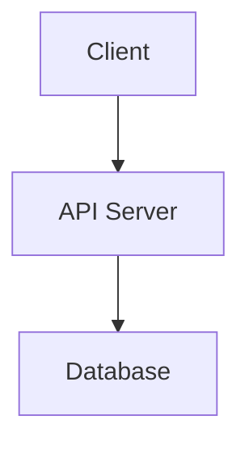

# Slidev Plugin for Claude Code

> Create developer-focused technical presentations using Slidev with evidence-based design guardrails

[](https://sli.dev)
[](https://opensource.org/licenses/MIT)

## What is this?

A Claude Code plugin for creating technical presentations powered by **[Slidev](https://sli.dev)** - the presentation framework for developers. Specifically designed for tech talks, conference presentations, internal demos, and developer-focused content.

**Key differentiator:** Evidence-based design principles are **enforced as guardrails**, not suggestions. The plugin automatically prevents common presentation mistakes through hard limits based on cognitive science research.

## Example Presentations

See real-world technical presentations created with this plugin, including source code and PDF exports:

- **[GPUs on Kubernetes Unlocked](https://github.com/ro14nd-talks/gpus-on-kubernetes-unlocked)** - Technical deep-dive on GPU scheduling ([PDF](https://github.com/ro14nd-talks/gpus-on-kubernetes-unlocked/blob/main/exports/GPUs%20on%20Kubernetes%20Unlocked.pdf))
- **[Lifting LLMs on K8s](https://github.com/ro14nd-talks/lifting-llms-on-k8s)** - Running large language models on Kubernetes ([PDF](https://github.com/ro14nd-talks/lifting-llms-on-k8s/blob/main/exports/Lifting%20Large%20Language%20Models%20on%20Kubernetes.pdf))

### Built on Slidev

[Slidev](https://sli.dev) is a web-based presentation tool built for developers. Write your slides in markdown, use Vue components, live code with Monaco editor, and export to PDF/PPTX. This plugin adds intelligent automation, evidence-based guardrails, and complete workflow management on top of Slidev's powerful foundation.

## Key Features

### 🎯 Evidence-Based Design Guardrails (Enforced)

These are not suggestions - they're automatic hard limits based on cognitive science research:

- **≤6 elements per slide** - Prevents information overload (Miller's Law: working memory holds 7±2 items)
- **<50 words body text** - Ensures slides support speech, not replace it
- **One idea per slide** - Automatically splits dense content into focused slides
- **Meaningful assertion titles** - "System handles 10K req/sec" not "Results"
- **18pt+ fonts, 4.5:1+ contrast** - Accessibility by default, not afterthought
- **Colorblind-safe palettes** - Blue + Orange default (tested for all types of colorblindness)

**When content exceeds limits:** The plugin creates additional slides instead of cramming. Quality over convenience.

### 🛠️ Developer-Focused Features

- **Code syntax highlighting** - Shiki/Prism integration with 100+ languages
- **Live coding** - Monaco editor embedded in slides for demos
- **Mermaid diagrams** - Architecture, flowcharts, sequence diagrams
- **Multi-platform diagrams** - Auto-generate PlantUML + Excalidraw alternatives
- **Modular slide files** - `01-title.md`, `02-hook.md` etc. in `slides/` directory
- **Git-friendly** - Meaningful diffs, easy collaboration

### 🔄 Complete Workflow

End-to-end presentation creation:

1. **Frame presentation scope** - Set duration, audience, and calculate target slide count
2. **Interactive brainstorming** - Web research and local file analysis
3. **Structured outline** with validation
4. **Modular slide generation** with enforced quality limits
5. **Visual enhancement** with diagrams and images
6. **Presenter notes** generation
7. **LaTeX handout** with prose explanations and research links
8. **Export** to PDF/PPTX/PNG

## Prerequisites

### Required

- **[Slidev](https://sli.dev)** - The presentation framework this plugin is built on
  ```bash
  npm install -g @slidev/cli
  ```
- **Node.js** (v18 or later)
- **npm** (comes with Node.js)

### Optional

- **LaTeX** (pdflatex) - For handout generation
  - macOS: `brew install --cask mactex-no-gui`
  - Ubuntu: `sudo apt-get install texlive-latex-base texlive-latex-extra`

- **mermaid-cli** - For high-quality offline diagram rendering
  ```bash
  npm install -g @mermaid-js/mermaid-cli
  ```

- **excalidraw-brute-export-cli** - For Excalidraw diagram rendering (auto-installed on first use)
  ```bash
  npm install -g excalidraw-brute-export-cli
  npx playwright install-deps
  npx playwright install chromium
  ```

## Installation

```bash
# From local directory (development)
cc --plugin-dir /path/to/slidev

# Or copy to plugin directory
cp -r slidev ~/.claude-plugins/
```

## Complete Workflow Example

Here's a full end-to-end workflow for creating a technical presentation:

### 1. Frame your presentation
```
/slidev:frame
```
Set presentation parameters: duration, audience level, and style. The plugin calculates target slide count using research-based timing (90s per slide default).

### 2. Brainstorm content
```
/slidev:brainstorm
```
Interactive Q&A session about your presentation topic. The plugin researches the web, analyzes local files, and extracts key themes within your framing constraints.

### 3. Create structured outline
```
/slidev:outline
```
Generates a structured outline with slide breakdown, validates timing against your framing, and ensures logical flow.

### 4. Generate modular slides
```
/slidev:generate
```
Creates individual slide files in `slides/` directory:
```
presentation/
├── slides.md                    # Master file (slide 1 = title from frontmatter)
├── slides/
│   ├── 02-hook.md              # Slide 2
│   ├── 03-problem-statement.md # Slide 3
│   ├── 04-architecture.md       # Slide 4
│   └── ...
```

**Note:** Slide 1 (title) comes from frontmatter in `slides.md`, so slide files start at `02-`.

Each slide is enforced to meet quality standards automatically.

### 5. Preview with Slidev
```
/slidev:preview
```
Opens Slidev dev server at `localhost:3030`. Press `p` for presenter mode with notes. Hot reload on file changes.

### 6. Edit specific slides
```
/slidev:edit 5
```
Shows table of contents, current slide content, and quality analysis. Edit individual slide files directly.

### 7. Enhance with visuals
```
/slidev:visuals
```
Analyzes all slides and suggests:
- Mermaid diagrams (flowcharts, sequence, architecture)
- Stock photos (Unsplash integration)
- AI image prompts (DALL-E, Midjourney, Stable Diffusion)

Generates multiple options per slide.

### 8. Generate comprehensive handout
```
/slidev:handout
```
Creates professional LaTeX handout with:
- Embedded slide images (PNG export)
- Prose explanations
- Research links and citations
- Presenter notes

### 9. Export final presentation
```
/slidev:export pdf
```
Exports to PDF, PPTX, or PNG using Slidev's built-in exporters.

**Result:** Professional technical presentation ready for your conference talk or demo!

## File Structure

When you create a presentation, the plugin generates this structure:

```
introduction-to-kubernetes/
├── slides.md                # Master Slidev file (slide 1 = title from frontmatter)
├── slides/
│   ├── 02-hook.md          # Slide 2 (first slide file)
│   ├── 03-problem.md       # Slide 3
│   ├── 04-kubernetes-architecture.md  # Slide 4
│   ├── 05-benefits.md      # Slide 5
│   └── ...
├── diagrams/                # ALL diagram sources (version controlled)
│   ├── kubernetes-architecture.mmd
│   ├── kubernetes-architecture.puml
│   ├── kubernetes-architecture.excalidraw
│   └── ...
├── presentation-config.md  # Framing parameters (duration, audience, etc.)
├── brainstorm.md           # Research and ideation notes
├── outline.md              # Validated presentation outline
├── handout.tex             # LaTeX handout source
├── handout.pdf             # Compiled handout
├── package.json            # Slidev dependencies
├── public/
│   └── images/             # Rendered diagrams and photos
│       ├── kubernetes-architecture/
│       │   ├── diagram.svg
│       │   ├── diagram-plantuml.svg
│       │   └── diagram-excalidraw.svg
│       └── ...
└── exports/
    ├── slides.pdf
    └── slides.pptx
```

**Modular slides benefits:**
- Files ordered in presentation sequence (`01-`, `02-`, etc.)
- Meaningful names for easy navigation
- Individual edits without touching other slides
- Git-friendly collaboration

**Diagram organization:**
- **Sources** (`diagrams/`): Version-controlled, editable (.mmd, .puml, .excalidraw)
- **Renders** (`public/images/`): Generated artifacts (.svg, .png), can be regenerated
- **NO EXCEPTIONS**: All sources MUST be in top-level `./diagrams/` directory

## All Commands

| Command | Description |
|---------|-------------|
| `/slidev:init <topic>` | Initialize new presentation project (full workflow orchestrator) |
| `/slidev:frame` | Define scope, duration, and slide count targets |
| `/slidev:brainstorm` | Interactive brainstorming with research |
| `/slidev:outline` | Create/revise presentation outline |
| `/slidev:generate` | Generate modular slides from outline |
| `/slidev:edit <N>` | Edit specific slide with context |
| `/slidev:add <N>` | Insert new slide at position N (shifts others back) |
| `/slidev:delete <N>` | Delete slide at position N with renumbering |
| `/slidev:continue` | Resume work on existing presentation |
| `/slidev:visuals` | Add diagrams and images to all slides |
| `/slidev:diagram <N>` | Create diagram for specific slide |
| `/slidev:notes` | Generate/enhance presenter notes |
| `/slidev:handout` | Generate LaTeX handout with slides and prose |
| `/slidev:preview` | Start Slidev dev server |
| `/slidev:export <format>` | Export to PDF, PPTX, PNG |
| `/slidev:redraw-diagrams` | Regenerate diagrams in multiple formats |

## Evidence-Based Design Principles

This plugin **enforces** (not suggests) design principles based on research from:
- MIT Communication Lab
- TED presentation guidelines
- PLOS Computational Biology
- Cognitive load research (Miller's Law)
- Accessibility standards (WCAG 2.1)

See [`references/presentation-best-practices.md`](references/presentation-best-practices.md) for full research documentation.

### Core Principles (Enforced)

**1. One Idea Per Slide**
- Each slide communicates exactly one central point
- If content requires >90 seconds, auto-split into multiple slides
- Slide title states the one clear finding

**2. Meaningful Titles (Assertions, Not Labels)**
- ❌ Bad: "Results", "Background", "Methods"
- ✅ Good: "System handles 10K req/sec", "Current solutions fail under load"
- Format: subject + verb + finding

**3. Cognitive Load Limit (≤6 Elements)**
- Count: bullets + images + diagrams + charts + code blocks
- **Hard limit:** If >6 elements → automatically split into multiple slides
- Research basis: Working memory capacity is 7±2 items

**4. Minimal Text (<50 Words)**
- Body text only - title not counted
- Use phrases, not sentences
- **Hard limit:** >50 words → split or move to presenter notes
- Detailed explanations go in presenter notes, not slides

**5. Visual Over Text**
- Almost every slide needs a visual (diagram, chart, image, code)
- Exceptions: quotes, definitions, transition slides
- Plugin suggests visuals during generation

**6. Accessibility by Default**
- **Font sizes:** Body ≥18pt, headings ≥24pt
- **Contrast:** ≥4.5:1 for all text
- **Colors:** Colorblind-safe palette (Blue + Orange default)
- **Don't rely on color alone:** Use patterns, labels, shapes

## For Developers

### Why This Plugin Exists

Generic presentation tools fail developers because:
- PowerPoint/Keynote: Not code-friendly, hard to version control
- Google Slides: No local workflow, limited code support
- Raw Slidev: Powerful but no guardrails against bad design

**This plugin solves that** by combining:
- Slidev's developer-friendly foundation (markdown, code, Git)
- Automatic enforcement of presentation best practices
- Complete workflow automation (brainstorm → export)
- Multi-platform diagram support

### Ideal Use Cases

- **Conference talks** - Tech conferences, meetups, user groups
- **Internal demos** - Architecture reviews, sprint demos, technical deep-dives
- **Training materials** - Developer onboarding, workshops, tutorials
- **Open source presentations** - Community presentations with Git collaboration

### Developer Features

**Code Syntax Highlighting:**
````markdown
```python {2-3}
def process():
    important_line()      # Highlighted
    another_important()   # Highlighted
    return result
```
````

**Live Coding (Monaco Editor):**
````markdown
```python {monaco}
def editable():
    return "Users can edit this code live"
```
````

**Mermaid Diagrams:**
````markdown

````

**Multi-Platform Diagrams:**
The plugin auto-generates equivalent diagrams in:
- Mermaid (inline in slides)
- PlantUML (high-quality SVG)
- Excalidraw (hand-drawn style)

## Configuration

Create `.claude/slidev.local.md` in your project for custom preferences:

```yaml
---
# Slidev settings
theme: seriph                     # default, apple-basic, etc.
export_format: pdf                # pdf, pptx, png

# Presentation defaults
default_duration_minutes: 15
slides_per_minute: 1.5           # 90 seconds per slide

# Visual theme
visual_theme:
  primary_color: "#3b82f6"       # Blue
  secondary_color: "#f97316"     # Orange
  style: "technical"             # modern-minimal, technical, etc.

# Rendering
mermaid_rendering: inline        # inline, offline, online
---
```

All fields optional with sensible defaults.

## Troubleshooting

### Slidev not found

Install Slidev globally:
```bash
npm install -g @slidev/cli
```

### Handout generation fails

Install LaTeX:
```bash
# macOS
brew install --cask mactex-no-gui

# Ubuntu/Debian
sudo apt-get install texlive-latex-base texlive-latex-extra

# Fedora/RHEL
sudo dnf install texlive-scheme-basic texlive-latex
```

### Mermaid diagrams low quality

Install mermaid-cli for offline high-quality rendering:
```bash
npm install -g @mermaid-js/mermaid-cli
```

### Excalidraw rendering fails

Install excalidraw-brute-export-cli and dependencies:
```bash
npm install -g excalidraw-brute-export-cli
npx playwright install-deps
npx playwright install chromium
```

Note: The script will auto-install these on first use if missing.

## Development

### Testing
```bash
cc --plugin-dir /path/to/slidev

# Test workflow
/slidev:init Test Presentation
```

## License

MIT © Roland Huss

## Credits

- Built with [Slidev](https://sli.dev) by Anthony Fu
- Evidence-based design principles from MIT Communication Lab, TED, PLOS Computational Biology
- Diagram support: Mermaid, PlantUML, Excalidraw

## Contributing

This is a personal plugin, but feedback and suggestions are welcome! File issues or reach out via email.

---

**Tip:** Start with `/slidev:init Your Topic` for a guided end-to-end workflow, or use individual commands for specific phases.
