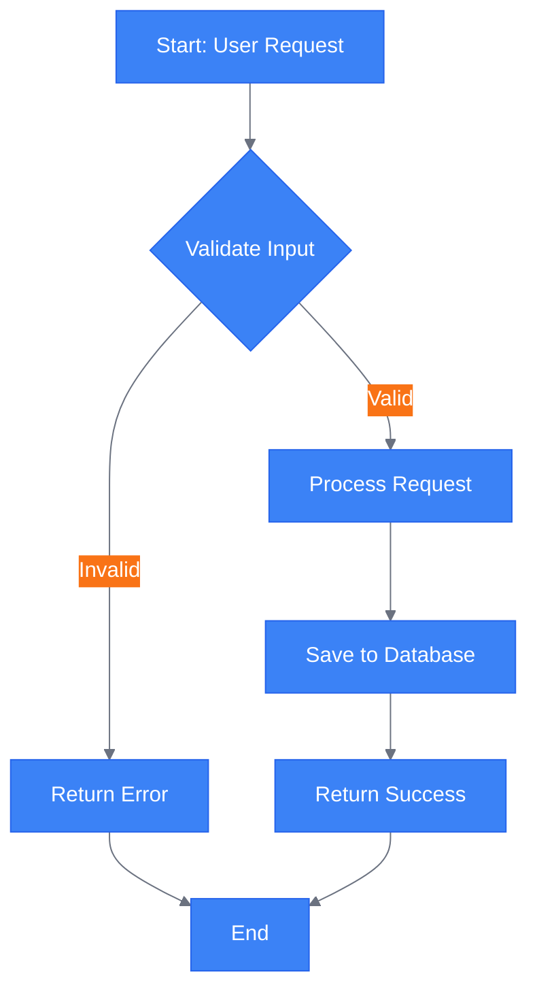
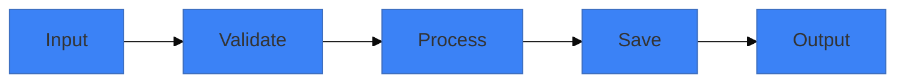
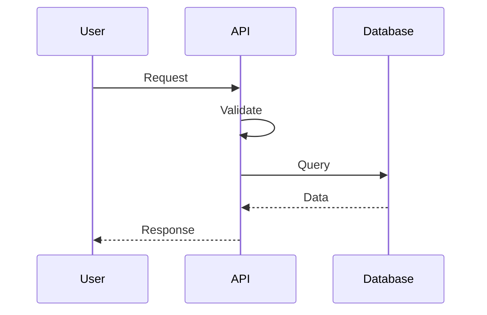
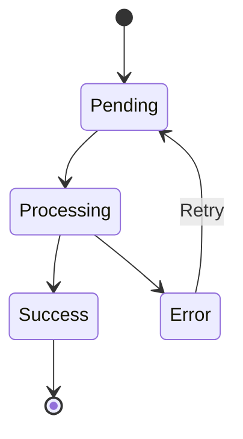
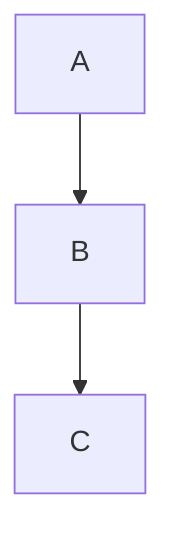

# Diagram Creation for Specific Slide

Focus on creating diagrams for a specific slide with **multi-platform support** (Mermaid, PlantUML, Excalidraw) using evidence-based cognitive load limits and colorblind-safe design.

**Evidence Base**: Diagram design follows research-based principles for cognitive load (max 7-9 nodes), colorblind accessibility, and visual clarity. See `references/presentation-best-practices.md` for guidelines.

**Multi-Platform**: Diagrams are automatically generated in all enabled formats (configurable in `default.json` or per-presentation `slidev.config.json`). Mermaid code is embedded inline by default, with PlantUML and Excalidraw alternatives saved for flexibility.

## Execution

**IMPORTANT - File Organization:**
- **Source files** (`.mmd`, `.puml`, `.excalidraw`) → Always save to `./diagrams/`
- **Rendered images** (`.svg`, `.png`) → Save to `./public/images/<slide-title>/`
- This keeps sources version-controlled separately from generated outputs

**CRITICAL - Embedding Rules:**
- **Mermaid**: CAN be embedded inline in markdown (Slidev renders it)
- **PlantUML**: NEVER embed - only reference rendered SVG images
- **Excalidraw**: NEVER embed - only reference rendered SVG images

### 1. Parse Slide Number

Extract from `$ARGUMENTS`:
- Must be valid number
- If missing: Ask "Which slide number should we create a diagram for?"

### 2. Read Target Slide

Find slides.md and locate slide:
- Extract slide content
- Check if diagram already exists
- Understand slide topic and content

Show user the slide:
```markdown
## Slide [N]: [Title]

**Current Content:**
[Slide content]

**Existing Visual:** [Yes: diagram type / No]
```

### 3. Analyze Content for Diagram Type (Evidence-Based)

**Determine Best Platform (Mermaid vs Excalidraw vs PlantUML):**

Analyze slide content to determine which platform best conveys the concept:

**Use Excalidraw (invoke skill) when:**
- Conceptual relationships need spatial layout
- Architecture with nested components (frames for boundaries)
- Brainstorming/ideation context (hand-drawn aesthetic)
- Informal, approachable style needed (whiteboard feel)
- Annotations and callouts would add value
- Mind maps or radial structures
- Keywords detected: "architecture", "components", "system design", "overview", "spatial"

**Use Mermaid (standard flow) when:**
- Linear process/workflow flows
- Sequence diagrams (time-based interactions)
- State machines (formal state transitions)
- Gantt charts (project timelines)
- ER diagrams (database schemas)
- Formal, structured diagrams preferred

**Use PlantUML when:**
- Formal UML notation required
- Deployment diagrams
- Complex class diagrams

**If Excalidraw is best fit:**

**CRITICAL: Excalidraw Workflow (NEVER embed JSON in markdown)**

1. Invoke the Excalidraw Generation skill using Skill tool:
   ```
   skill: "slidev:excalidraw-generation"
   ```

2. The skill will:
   - Create Excalidraw JSON at `diagrams/<slug>.excalidraw`
   - Render to SVG at `public/images/<slug>/diagram-excalidraw.svg`
   - **NOT embed JSON in markdown**

3. Add SVG image reference to slide (NOT the JSON):
   ```markdown
   
   ```

The skill takes over the complete generation process with semantic redesign approach.

**If Mermaid/PlantUML is best fit, continue below:**

Use visual-design skill to determine appropriate Mermaid diagram types:

**Process/Workflow** → Flowchart (max 7-9 nodes)
**System Interaction** → Sequence Diagram (max 5-7 participants)
**Data Structure** → Class/ER Diagram (max 6-8 entities)
**State Changes** → State Diagram (max 7-9 states)
**Timeline** → Gantt Chart (max 6-8 tasks)
**Architecture** → Component/Deployment Diagram (max 7-9 components)

**Cognitive load research**: Working memory handles 7±2 items. Keep diagrams within this limit for instant comprehension.

### 4. Generate Multiple Diagram Options

Create 2-4 variations showing different approaches:

```markdown
## Diagram Options for Slide [N]

### Option 1: Flowchart (Top-Down) ⚡

**Best for:** Showing linear process flow

**Evidence-based design:**
- **Node count**: 7 nodes (within 7±2 cognitive load limit ✓)
- **Colorblind-safe**: Blue + Orange palette (verified safe)
- **Contrast**: All text meets 4.5:1 minimum
- **Readability**: Sans-serif labels, clear arrows

**Diagram:**


**Element count check**: Diagram = 1 element. Verify total slide elements ≤6.

**Pros:**
- Clear linear flow
- Shows decision points
- Easy to follow
- Within cognitive load limit (7 nodes)

**Cons:**
- Takes more vertical space

---

### Option 2: Flowchart (Left-Right) ⚡

**Best for:** Fitting in wide slides

**Diagram:**


**Pros:**
- Compact, fits in image-right layout
- Clean and simple

**Cons:**
- Less detail than Option 1

---

### Option 3: Sequence Diagram ⚡

**Best for:** Showing interactions over time

**Diagram:**


**Pros:**
- Shows temporal flow
- Clear component interactions

**Cons:**
- Different perspective than flowchart

---

### Option 4: State Diagram ⚡

**Best for:** Showing status changes

**Diagram:**


**Pros:**
- Shows state transitions
- Clear lifecycle

**Cons:**
- More abstract

---

**Which option works best for your slide?**
1. Flowchart Top-Down (detailed)
2. Flowchart Left-Right (compact)
3. Sequence Diagram (interaction focus)
4. State Diagram (lifecycle focus)
5. Let me create a custom variation
```

### 5. Generate Multi-Platform Diagram

Based on user selection, generate diagram in all enabled formats:

**Step 1: Extract slide title for directory naming**
Read the slide to get its title for creating organized storage.

**Step 2: Generate all formats using orchestration script**
```bash
${CLAUDE_PLUGIN_ROOT}/scripts/generate-multi-platform-diagram.sh \
  "[Slide Title]" \
  "[Mermaid Code]" \
  "."
```

This automatically:
- Creates `diagrams/` directory for source files
- Creates `public/images/<slide-title-mangled>/` directory for rendered images
- Generates Mermaid source (diagrams/<slug>.mmd) and rendered image (public/images/<slug>/diagram.svg)
- Translates to PlantUML (diagrams/<slug>.puml) and renders if enabled
- Translates to Excalidraw (diagrams/<slug>.excalidraw) and renders if enabled
- Applies colorblind-safe theme to all formats

**Directory Structure:**
```
diagrams/                            # ALL sources (top-level, version controlled)
  ├── <slug>.mmd                     # Mermaid source
  ├── <slug>.puml                    # PlantUML source
  └── <slug>.excalidraw              # Excalidraw JSON source

public/images/<slug>/                # Rendered images only
  ├── diagram.svg                    # Mermaid rendered
  ├── diagram-plantuml.svg           # PlantUML rendered
  └── diagram-excalidraw.svg         # Excalidraw rendered
```

**NO EXCEPTIONS**: Sources ALWAYS go in `./diagrams/`, renders go in `./public/images/<slug>/`

**Step 3: Embed Mermaid inline in slide (default)**
Add diagram directly to slide:
```markdown
# Slide Title

Content before diagram

```mermaid
[chosen diagram code with theme variables]
```

Remaining content
```

**Step 4: Show user all generated formats**
```markdown
✅ Diagram Generated for Slide [N]: [Title]

**Embedded in slide**: Mermaid (inline rendering by Slidev)

**Source files in** `diagrams/`:
- `[slug].mmd` - Mermaid source
- `[slug].puml` - PlantUML source (if enabled)
- `[slug].excalidraw` - Excalidraw JSON source (if enabled)

**Rendered images in** `public/images/[mangled-title]/`:
- `diagram.svg` - Mermaid rendered (if mmdc available)
- `diagram-plantuml.svg` - PlantUML rendered (if enabled)
- `diagram-excalidraw.svg` - Excalidraw rendered (if enabled)

**To switch formats in slide:**
Replace mermaid code block with image reference:


**To edit sources:**
- Mermaid: Edit `diagrams/[slug].mmd`
- PlantUML: Edit `diagrams/[slug].puml`
- Excalidraw: Open `diagrams/[slug].excalidraw` at https://excalidraw.com
```

### 6. Customize Diagram

Offer customization:

**Theme Colors (Colorblind-Safe):**
"Should we adjust the colors to match your presentation theme?"

Apply colorblind-safe theme (Blue + Orange verified safe):
```mermaid
%%{init: {'theme':'base', 'themeVariables': {
  'primaryColor':'#3b82f6',      /* Blue - 8.6:1 contrast */
  'secondaryColor':'#f97316',    /* Orange - 3.4:1 (headings) */
  'lineColor':'#6b7280',         /* Gray - neutral */
  'tertiaryColor':'#8b5cf6'      /* Purple - accent */
}}}%%
```

**Accessibility verification:**
- Blue on white: 8.6:1 contrast ✓
- Orange on white: 3.4:1 (headings ≥24pt only) ✓
- Safe for deuteranopia, protanopia, tritanopia ✓

**Complexity (Evidence-Based Limits):**
"Should we simplify (fewer nodes) or add more detail?"

**Cognitive load guidance:**
- Current nodes: [X]
- Recommended max: 7-9 nodes (working memory limit)
- If >9 nodes: **Strongly recommend splitting** into multiple slides
- If <5 nodes: Can add detail if needed

Adjust based on feedback while enforcing evidence-based limits.

**Layout:**
"Should we use a different layout?"
- Change `graph TD` to `graph LR`
- Rearrange nodes
- Adjust spacing

### 7. Preview and Iterate

Show updated slide:
```markdown
## Updated Slide [N]

[Full slide with new diagram]

---

**Changes:**
- Added [diagram type]
- Applied theme colors
- [Other changes]

Does this work? Any adjustments needed?
```

Allow iteration:
- Tweak diagram
- Change type
- Adjust colors
- Simplify/complexify

### 8. Final Confirmation

Once satisfied:
```markdown
## ✅ Diagram Added to Slide [N]

**Diagram Type:** [Type]
**Rendering:** [Inline / Offline SVG]
**Theme:** [Colors applied]

**Preview:**
```bash
cd [presentation-dir]
slidev slides.md
```
Navigate to slide [N] to see diagram.

**Edit Diagram:**
Diagram code is in `slides.md` at slide [N].
Edit directly or run `/slidev:diagram [N]` again.
```

## Diagram Types Reference

Quick guide for user:

**Flowchart** - Processes, workflows, algorithms
- `graph TD` (top-down) or `graph LR` (left-right)
- Rectangles, diamonds (decisions), arrows

**Sequence** - API calls, interactions, message flow
- Shows temporal sequence
- Participants and messages

**Class** - Object models, data structures
- Classes with attributes/methods
- Relationships (inheritance, association)

**State** - Lifecycles, status transitions
- States and transitions
- Start/end states

**ER** - Database schemas, data relationships
- Entities and relationships
- Cardinality

**Gantt** - Timelines, schedules, roadmaps
- Tasks over time
- Dependencies

## Advanced Options

**Multiple diagrams:**
"Should we add multiple diagrams to this slide?"
- Use `two-cols` layout
- Show different perspectives
- Before/after comparison

**Interactive diagrams:**
"Want to add click animations?"
```markdown

```

**Custom styling:**
"Want to customize beyond theme colors?"
- Node shapes
- Line styles
- Icons in nodes
- Custom CSS

## Error Handling

**Diagram too complex:**
- Simplify (max 7-9 nodes recommended)
- Split into multiple diagrams
- Use higher-level abstraction

**Rendering issues:**
- Fall back to inline
- Check mermaid syntax
- Provide code for manual rendering

**Doesn't fit slide:**
- Try different layout (LR vs TD)
- Use image-right layout
- Make diagram full-slide

## Evidence-Based Diagram Quality Standards

**Cognitive Load (CRITICAL):**
- ✓ Max 7-9 nodes/elements (working memory research)
- ✓ If >9: Split into multiple diagrams or slides
- ✓ Progressive disclosure: Build complex diagrams across slides

**Accessibility (REQUIRED):**
- ✓ Colorblind-safe palette (Blue + Orange verified)
- ✓ Don't rely on color alone (use labels + shapes + patterns)
- ✓ High contrast: 4.5:1+ for all text
- ✓ Font sizes: Match slide minimum (≥18pt equivalent)

**Visual Clarity:**
- ✓ Clear directional flow (typically left-to-right or top-to-bottom)
- ✓ Consistent node naming and shapes
- ✓ Minimal crossing lines (reduce visual complexity)
- ✓ Adequate spacing between elements

**Element Count:**
- Diagram counts as **1 element** in total slide count
- Verify: diagram + bullets + other content ≤6 total elements

## Tips

- **Enforce cognitive load limit** (max 7-9 nodes, split if more)
- **Use colorblind-safe theme** (Blue #3b82f6 + Orange #f97316)
- **Don't rely on color alone** (add labels and shapes)
- **Apply theme colors consistently** for cohesion
- **Test in preview** before finalizing
- **Consider slide layout** when choosing diagram type (TD vs LR)
- **Simplify complex diagrams** (higher abstraction level or multiple slides)

Inform user diagram is complete!
