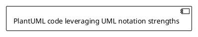

# Visual Enhancement Workflow

Analyze all slides and provide interactive visual enhancement with **multi-platform diagrams** (Mermaid, PlantUML, Excalidraw), images, and AI prompts using evidence-based best practices.

**Evidence Base**: Visual enhancements follow research-based principles for cognitive load, accessibility, and effective communication. See `references/presentation-best-practices.md` for guidelines.

**Multi-Platform**: All diagrams are automatically generated in enabled formats (Mermaid + PlantUML + Excalidraw). Mermaid embedded inline, alternatives saved in organized directories for flexibility.

## Execution

### 1. Read Slides

Find and parse slides.md with CORRECT Slidev numbering:

**IMPORTANT: Generate accurate slide numbering first**

**CRITICAL: Slidev Slide Numbering**
**Read master slides.md directly:**

Read the master `slides.md` file containing slide comments:

```markdown
---
src: ./slides/title.md
---
<!-- Slide 1: Title -->

---
src: ./slides/microservices-benefits.md
---
<!-- Slide 5: Microservices Benefits -->
```

Extract slide information by parsing comment pattern: `<!-- Slide \d+: .* -->`

**Output Format for Analysis:**
Always reference slides as: **"Slide X (Title)"**
Example: "Slide 21 (Device Plugins Turn GPUs Into Schedulable Resources)"

**Analysis Tasks:**
- Read slides.md to extract all slide comments
- Count total slides (count comments)
- Extract slide titles from comment descriptions
- Read individual slide files (from `src:` paths) to check for:
  - Existing visuals (mermaid blocks, image references)
  - Visual placeholders (`<!-- TODO: Visual`)
  - Content that needs visuals

### 2. Analyze Visual Opportunities (Evidence-Based)

**When instructing the visual-suggester agent:**

```
Analyze slides.md for visual opportunities.

Read the master slides.md file and extract slide numbers from comments:
<!-- Slide X: Description -->

Use these EXACT slide numbers in your analysis.

When reporting opportunities, use format: "Slide X (Title)" where X matches the comment numbers.

Identify slides needing visuals based on:
- **One idea per slide**: Does visual support the single central message?
- **Cognitive load**: Will visual + text + bullets stay ≤6 total elements?
- **Visual over text**: Can diagram replace text-heavy explanations?
- **Accessibility**: Can visual work with colorblind-safe colors?
```

Agent returns prioritized list of slides needing visuals with CORRECT slide numbers (verified by Python script).

### 3. Present Overview

Show user the analysis:
```markdown
## Visual Enhancement Analysis

**Slides Analyzed:** [X] total

**Visual Opportunities Found:**

### High Priority (Needs Visual)
- Slide 3: [Title] - [Why visual needed]
- Slide 7: [Title] - [Why visual needed]
- Slide 12: [Title] - [Why visual needed]

### Medium Priority (Would Benefit)
- Slide 5: [Title] - [Optional enhancement]
- Slide 9: [Title] - [Optional enhancement]

### Low Priority (Already Good)
- Slide 1: [Title] - [Already has visual]
- ...

**Recommendation:** Focus on [N] high-priority slides.

Should we enhance all high-priority slides, or would you like to select specific ones?
```

### 4. Interactive Selection Mode

For each slide to enhance (based on user choice):

**Present Options:**
```markdown
---
## Slide [N]: [Title]

**Current State:**
[Brief content summary]
[X] words, [Y] bullets, [Z] visuals
**Element count:** [Total elements] (target: ≤6)

**Visual Options:**

**IMPORTANT: Platform-Specific Semantic Design**
- Each platform below represents a **different visual thinking approach**
- Don't convert between platforms - **redesign for each platform's strengths**
- Consider slide semantics, not just diagram structure

---

### Option 1: Mermaid Diagram ⚡

**Best for:** Flow, process, state transitions, sequences (clean, developer-friendly)

**Why this works for this slide:**
[Explanation of how Mermaid's linear/structured approach supports the slide's ONE IDEA]

**Mermaid-specific design thinking:**
- Emphasizes **flow and direction** (great for pipelines, workflows, state machines)
- Clean, minimal aesthetic - good for technical audiences
- Real-time rendering in Slidev (inline)
- Best diagram type for this content: [flowchart/sequence/state/gantt/etc.]

**Evidence-based design:**
- Max 7-9 nodes (cognitive load research: working memory limit)
- Colorblind-safe theme colors applied
- Supports slide assertion without overloading

**Diagram Code:**
```mermaid
%%{init: {'theme':'base', 'themeVariables': {
  'primaryColor':'#3b82f6',
  'secondaryColor':'#f97316',
  'lineColor':'#6b7280'
}}}%%
[Complete working mermaid code designed FOR Mermaid's strengths]
```

**Element count check:** Diagram counts as 1 element. Current slide total: [X] elements (target: ≤6)

---

### Option 2: PlantUML Diagram 🏗️

**Best for:** UML, architecture, complex relationships, formal modeling

**Why PlantUML for this slide:**
[Explanation of how PlantUML's modeling capabilities fit the slide's semantic content]

**PlantUML-specific design thinking:**
- Emphasizes **relationships and structure** (components, classes, deployments)
- Formal notation - good for architectural discussions
- Rich set of diagram types (component, class, deployment, timing, etc.)
- Best diagram type for this content: [component/class/deployment/sequence/activity]

**Semantic redesign (not conversion from Mermaid):**
- What architectural elements does this slide discuss?
- What relationships need to be shown?
- What UML stereotypes add clarity?

**Diagram Code:**
```plantuml
@startuml
!theme plain
skinparam backgroundColor white

[PlantUML code designed specifically for PlantUML's capabilities]
- Uses PlantUML-specific features (stereotypes, packages, interfaces)
- Leverages PlantUML's layout algorithms
- Not a conversion - a semantic reimagining

@enduml
```

**Why not just convert from Mermaid?**
PlantUML excels at showing component boundaries, deployment contexts, and formal relationships that Mermaid doesn't emphasize.

---

### Option 3: Excalidraw Diagram ✏️

**Best for:** Sketchy/informal style, brainstorming feel, hand-drawn aesthetic, annotations

**Why Excalidraw for this slide:**
[Explanation of how Excalidraw's informal, sketchy style fits the slide's tone/message]

**Excalidraw-specific design thinking:**
- Emphasizes **approachability and informality** (great for brainstorming, ideation, workshops)
- Hand-drawn style reduces intimidation
- Flexible annotations and callouts
- Editable at excalidraw.com for collaboration

**Semantic redesign considerations:**
- What spatial relationships matter? (Excalidraw has flexible positioning)
- What annotations or callouts add insight?
- How can hand-drawn style make concept more approachable?
- What groupings or containers clarify structure?

**Diagram approach:**
[Description of diagram design leveraging Excalidraw's strengths:
- Rough rectangles with annotations
- Arrows with labels
- Grouping boxes or containers
- Spatial positioning to show relationships
- Color-coded regions]

**Note:** Will be generated as editable .excalidraw JSON that you can refine at https://excalidraw.com

**Why not just convert from Mermaid?**
Excalidraw excels at informal visual thinking, spatial reasoning, and collaborative sketching that structured diagrams miss.

---

### Option 4: Stock Photo 📷

**Search Terms:**
- "[Primary term]"
- "[Alternative term]"

**Suggested Images:**
1. [Specific photo description] - Unsplash
   https://unsplash.com/photos/[id]

2. [Alternative description] - Pexels
   https://www.pexels.com/photo/[id]

**Usage:** image-right layout or background (30% opacity)?

---

### Option 4: AI-Generated Image 🎨

**DALL-E 3 Prompt:**
```
[Detailed, well-structured prompt]
```

**Midjourney Prompt:**
```
/imagine [prompt] --ar 16:9 --v 6 --style raw
```

**Stable Diffusion:**
```
Positive: [prompt]
Negative: [negative]
```

**To use:** Generate image, save to `public/images/`, reference in slide.

---

**Which option for Slide [N]?**
1. Mermaid diagram (flow/process emphasis)
2. PlantUML diagram (architecture/UML emphasis)
3. Excalidraw diagram (sketchy/informal style)
4. Stock Photo (I'll provide URL)
5. AI Image (save prompts for later)
6. Skip this slide
```

### 5. Implement Chosen Option

Based on user choice:

#### **Option 1: Mermaid Diagram (Semantic Design)**

1. Design Mermaid diagram based on slide semantics (not conversion)
2. Extract slide title from the slide being enhanced
3. Create Mermaid code leveraging Mermaid's strengths (flow, process, sequences)
4. Add inline to slide (Slidev renders in real-time):

```markdown
# Slide Title

Content here

```mermaid
%%{init: {'theme':'base', 'themeVariables': {'primaryColor':'#3b82f6'}}}%%
[Mermaid code designed for Mermaid's visual paradigm]
```
```

5. Generate multi-platform versions:
   ```bash
   ${CLAUDE_PLUGIN_ROOT}/scripts/generate-multi-platform-diagram.sh \
     "[Slide Title]" \
     "[Mermaid Code]" \
     "."
   ```
6. This saves all platform versions in `public/images/<readable-slug>/`

#### **Option 2: PlantUML Diagram (Semantic Design)**

1. Design PlantUML diagram from scratch based on slide's architectural/structural semantics
2. Use PlantUML-specific features (stereotypes, packages, deployment nodes, etc.)
3. Create PlantUML source:



4. Save PlantUML as primary, generate others:
   ```bash
   # Save PlantUML source
   cat > /tmp/diagram.puml <<'EOF'
   [PlantUML code]
   EOF

   # Generate directory with PlantUML as source
   ${CLAUDE_PLUGIN_ROOT}/scripts/generate-from-plantuml.sh \
     "[Slide Title]" \
     "$(cat /tmp/diagram.puml)" \
     "."
   ```

5. Add reference to slide (PlantUML rendered image):
   ```markdown
   
   ```

#### **Option 3: Excalidraw Diagram (Semantic Design)**

1. Design Excalidraw diagram emphasizing spatial relationships and informal style
2. Create Excalidraw JSON with semantic layout:
   - Position elements to show conceptual relationships
   - Use grouping containers for context
   - Add annotations and callouts
   - Hand-drawn style for approachability

3. Generate Excalidraw source:
   ```bash
   # Create semantic Excalidraw design
   ${CLAUDE_PLUGIN_ROOT}/scripts/create-excalidraw-diagram.sh \
     "[Slide Title]" \
     "[Design description]" \
     "."
   ```

4. Inform user:
   ```
   ✅ Excalidraw diagram created at:
   public/images/<slug>/diagram.excalidraw

   To refine:
   1. Open https://excalidraw.com
   2. Load diagram.excalidraw
   3. Adjust positioning, add annotations
   4. Export as needed
   ```

5. Add reference to slide:
   ```markdown
   
   ```

**Stock Photo:**
1. Ask user: "Provide the image URL you chose"
2. Download image:
   ```bash
   ${CLAUDE_PLUGIN_ROOT}/scripts/download-image.sh [URL] public/images
   ```
3. Update slide with image reference:
   ```markdown
   ---
   layout: image-right
   image: './public/images/[filename]'
   ---
   ```

**AI Image:**
1. Save prompts to `ai-image-prompts.md`:
   ```markdown
   ## Slide [N]: [Title]

   ### DALL-E 3
   ```
   [prompt]
   ```

   ### Midjourney
   ```
   [prompt]
   ```

   ### Stable Diffusion
   ```
   Positive: [prompt]
   Negative: [negative]
   ```

   **To use:**
   1. Generate image with service of choice
   2. Save as `public/images/slide-[N]-[description].png`
   3. Update slide: `image: './public/images/slide-[N]-[description].png'`
   ```

2. Add placeholder to slide:
   ```markdown
   <!-- TODO: Add AI-generated image
   See ai-image-prompts.md for prompts
   Filename: slide-[N]-[description].png
   -->
   ```

### 6. Track Progress

Update user after each slide:
```markdown
✅ Slide [N] enhanced with [option type]

Progress: [X] of [Y] slides enhanced
```

### 7. Theme Consistency Check

After enhancements, verify:
- All mermaid diagrams use same theme colors
- Images match visual style
- Layouts are consistent
- No jarring transitions

### 8. Final Summary

Present completion:
```markdown
## ✅ Visual Enhancement Complete!

**Slides Enhanced:** [X] of [Y]

**Enhancements Added:**
- Mermaid diagrams: [N] slides
- Stock photos: [M] slides
- AI image prompts saved: [P] slides
- Skipped: [Q] slides

**Files Updated:**
- `slides.md` - Diagrams and images added
- `ai-image-prompts.md` - Prompts for [P] images

**Next Steps:**

1. **Generate AI images** (if any):
   - Open `ai-image-prompts.md`
   - Use DALL-E/Midjourney/SD to generate
   - Save to `public/images/`
   - Update slide references

2. **Preview updated slides:**
   ```bash
   cd [presentation-dir]
   slidev slides.md
   ```

3. **Download stock photos** (if pending):
   - URLs are in comments
   - Or I can download them now

4. **Export final version:**
   `/slidedeck:export pdf`

**Visual Theme:**
- Colors: [Primary], [Secondary], [Accent]
- Style: [Consistent/Modern/Professional]
- All diagrams themed consistently ✓
```

## Batch vs Individual Mode

**Batch Mode** (default):
- Analyze all slides first
- Show prioritized list
- User selects which to enhance
- Process selected slides

**Individual Mode:**
- Ask: "Process slides one-by-one or show all opportunities first?"
- If one-by-one: Present each slide, get decision, move to next
- If all: Batch mode above

## Visual Theme Management

Extract or establish theme:
```yaml
Colors:
  primary: "#3b82f6"    # From settings or slides
  secondary: "#8b5cf6"
  accent: "#f59e0b"

Style: modern-minimal  # From settings or infer
```

Apply to all mermaid diagrams and suggest for images.

## Error Handling

**Mermaid rendering fails:**
- Fall back to inline
- Provide code anyway
- User can render manually at mermaid.live

**Image download fails:**
- Save URL in comment
- User can download manually
- Offer alternative image

**Too many options overwhelming:**
- Limit to top 2-3 options
- Focus on most impactful
- Allow "use your best judgment" mode

## Evidence-Based Visual Selection Criteria

**Do add visuals when:**
- Slide is text-heavy (>50 words) and diagram can replace text
- Process/workflow/architecture needs visualization
- Data or statistics are being presented
- Slide lacks visual interest
- Abstract concept needs concrete representation

**Don't add visuals when:**
- Adding visual would exceed 6 total elements
- Slide is a bold statement/quote (visual competes)
- Current slide is already visually balanced
- Diagram would be too complex (>9 nodes)
- Visual doesn't directly support the slide's ONE idea

**Colorblind-Safe Palette (Applied to all diagrams):**
- Primary: Blue (#3b82f6) - 8.6:1 contrast
- Secondary: Orange (#f97316) - 3.4:1 (headings only)
- Neutral: Gray (#6b7280)
- Verified safe for deuteranopia, protanopia, tritanopia

## Tips

- **Start with high-priority slides** (those exceeding 50 words or lacking visuals)
- **Maintain consistent visual language** (same diagram style throughout)
- **Don't overdo it** (not every slide needs diagram - some work better as bold statements)
- **Enforce cognitive load limit** (each diagram + surrounding content ≤6 total elements)
- **Keep diagrams simple** (max 7-9 nodes per research)
- **Test colorblind-safe** (use ColorBrewer-verified palettes)
- **Preview before finalizing** (check actual rendering)
- **Save AI prompts** even if not using now

Inform user visual enhancement is complete!
