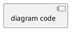
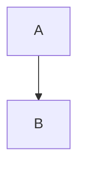

# Redraw Diagrams - Semantic Redesign Across Platforms

Extract inline diagrams from slides and **semantically redesign** them for each platform's strengths, rather than mechanically converting between formats.

**Philosophy:** Each diagram platform (Mermaid, PlantUML, Excalidraw) has unique visual paradigms. This command analyzes the slide's semantic content and existing diagrams, then **redesigns** diagrams to leverage each platform's specific capabilities.

**CRITICAL - Excalidraw Rule**: NEVER embed Excalidraw JSON in markdown files. Always:
1. Write JSON to `diagrams/<slug>.excalidraw`
2. Convert to SVG using `render-excalidraw.sh`
3. Put SVG in `public/images/<slug>/diagram-excalidraw.svg`
4. Reference only the SVG image in markdown

**Use Cases:**
- Redesign existing diagrams to better utilize platform features
- Create platform-specific versions that aren't just conversions
- Improve diagram quality by rethinking visual approach per platform

## Execution

### 1. Find Presentation

Locate slides.md:
- Check current directory
- Check subdirectories
- If multiple found: ask user which one

### 2. Get Slide Mapping from Master slides.md

Read master slides.md directly to extract slide information:

```markdown
---
src: ./slides/01-title.md
---
<!-- Slide 1: Title -->

---
src: ./slides/05-microservices-benefits.md
---
<!-- Slide 5: Microservices Benefits -->
```

Parse comment pattern `<!-- Slide \d+: .* -->` to get:
- Slide numbers
- Slide titles/descriptions for directory naming
- File paths (from `src:` lines)

### 3. Extract and Analyze Diagrams Semantically

Scan slides.md for diagram code blocks:

**Mermaid diagrams:**
```markdown
```mermaid
[diagram code]
```
```

**PlantUML diagrams:**
```markdown

```

**For each diagram found:**
1. Note slide number and title
2. Extract complete diagram code
3. **Read slide content** to understand semantic context
4. **Analyze diagram semantics:**
   - What concept is being visualized?
   - Is it showing flow/process, architecture/structure, or concepts/relationships?
   - What is the diagram's intent?
5. Identify existing diagram type and platform

### 4. Present Extraction Summary

Show user what was found:

```markdown
## Diagrams Found in Presentation

**Total diagrams:** [N]

### Mermaid Diagrams
- Slide 5 (Introduction to GPUs): flowchart (7 nodes)
- Slide 12 (Device Plugin Workflow): sequence diagram
- Slide 21 (Scheduling Process): flowchart (9 nodes)

### PlantUML Diagrams
- Slide 18 (Architecture Overview): component diagram

### No Diagrams
- [List slides that could benefit from diagrams]

**Proceed with regeneration?**
```

### 5. Redesign Each Diagram Semantically

For each extracted diagram:

**Step 1: Analyze Slide and Diagram Semantics**

Read the full slide content (not just the diagram code):

```bash
# Get slide content from line range
SLIDE_CONTENT=$(sed -n 'START,END p' slides.md)
```

**Semantic Analysis Questions:**
- What is the slide's core message?
- What semantic concept is the existing diagram showing?
  - **Flow/Process?** (A→B→C transformation)
  - **Architecture/Structure?** (Components and relationships)
  - **Concept/Idea?** (Abstract thinking, spatial relationships)
- Does the existing diagram leverage its platform's strengths well?

**Step 2: Redesign for Each Platform**

**IMPORTANT:** Don't mechanically convert. Redesign based on semantics.

**For Mermaid (Primary if existing diagram is Mermaid):**
- Keep or improve existing Mermaid design
- Consider if different Mermaid diagram type would be better:
  - `flowchart` for processes
  - `sequenceDiagram` for interactions
  - `stateDiagram` for lifecycles
  - `graph` for relationships

**For PlantUML (Semantic redesign):**
- **Don't convert syntax** - redesign conceptually
- Ask: "How would I show this architecture/structure in UML?"
- Consider PlantUML-specific diagram types:
  - `@startuml component` for component architecture
  - `@startuml deployment` for physical topology
  - `@startuml class` for object relationships
  - `@startuml activity` for processes (different from Mermaid flow)
- Use PlantUML features: packages, stereotypes, interfaces, notes

**For Excalidraw (Semantic redesign):**
- **Don't convert shapes** - rethink spatially
- Ask: "How would I sketch this on a whiteboard?"
- Design for Excalidraw strengths:
  - Spatial positioning (proximity = relationship)
  - Grouping containers (context)
  - Annotations and callouts (narrative)
  - Hand-drawn style (approachability)

**Step 3: Generate Platform-Specific Versions**

Create separate, thoughtfully designed diagrams:

```bash
# 1. Save/keep Mermaid (if it's the original)
cat > /tmp/diagram-mermaid.mmd <<'EOF'
[Mermaid code - original or improved]
EOF

# 2. Design PlantUML from semantic analysis
cat > /tmp/diagram-plantuml.puml <<'EOF'
@startuml
[PlantUML code designed for PlantUML's strengths]
@enduml
EOF

# 3. Design Excalidraw layout (describe or generate JSON)
# For now, use conversion as starting point for manual refinement
```

**Step 4: Generate all formats**

**CRITICAL: ALL sources go to top-level `./diagrams/`, renders to `./public/images/<slug>/`**

```bash
SLIDE_TITLE="Slide N: [Title]"
SLUG=$(${CLAUDE_PLUGIN_ROOT}/scripts/create-diagram-slug.sh "$SLIDE_TITLE" N)

# Create directories (sources at top-level)
mkdir -p "./diagrams"
mkdir -p "./public/images/$SLUG"

# Save all platform sources to top-level diagrams/
cp /tmp/diagram-mermaid.mmd "./diagrams/$SLUG.mmd"
cp /tmp/diagram-plantuml.puml "./diagrams/$SLUG.puml"
cp /tmp/diagram-excalidraw.excalidraw "./diagrams/$SLUG.excalidraw"

# Render each to public/images/<slug>/
${CLAUDE_PLUGIN_ROOT}/scripts/render-mermaid.sh "./diagrams/$SLUG.mmd" "./public/images/$SLUG/diagram.svg" "svg"
${CLAUDE_PLUGIN_ROOT}/scripts/render-plantuml.sh "./diagrams/$SLUG.puml" "./public/images/$SLUG/diagram-plantuml.svg" "svg"
${CLAUDE_PLUGIN_ROOT}/scripts/render-excalidraw.sh "./diagrams/$SLUG.excalidraw" "./public/images/$SLUG/diagram-excalidraw.svg"
```

**Step 5: Track progress and explain redesigns**

Update user after each diagram:
```markdown
✅ Slide 21: Device Plugins Turn GPUs Into Schedulable Resources

   **Semantic Redesigns:**
   - **Mermaid:** flowchart emphasizing plugin→kubelet→scheduler flow
   - **PlantUML:** component diagram showing gRPC interfaces and packages
   - **Excalidraw:** spatial sketch with "node" container and control plane separation

   **Sources:** diagrams/slide-21-device-plugins-gpus.*
   **Rendered:** public/images/slide-21-device-plugins-gpus/diagram*.svg

   Generated:
   - diagram.mmd + diagram.svg (Mermaid)
   - diagram.puml + diagram-plantuml.svg (PlantUML)
   - diagram.excalidraw + diagram-excalidraw.svg (Excalidraw)

   **Why different designs?**
   Each platform emphasizes what it does best - Mermaid for flow,
   PlantUML for architecture, Excalidraw for informal sketching.
```

### 6. Handle Existing Directories

If diagram directory already exists:

**Ask user:**
```
Directory public/images/slide-21-device-plugins-gpus/ already exists.

Options:
1. Skip (keep existing)
2. Overwrite (regenerate all)
3. Update (regenerate only if source changed)
```

**For "Update" option:**
- Compare inline code with existing diagram.mmd
- Only regenerate if different
- Preserve manually edited files

### 7. Update Slide References (Optional)

**Default: Keep Mermaid inline**
The Mermaid diagram stays embedded in the slide (Slidev renders it).

**Optional: Switch to other platforms**
Offer to replace inline Mermaid with PlantUML or Excalidraw image:

**Current (Mermaid inline):**
```markdown

```

**Option A: PlantUML image (architecture emphasis):**
```markdown

```

**Option B: Excalidraw image (sketchy style):**
```markdown

```

**Ask user:**
"Primary diagram platform for each slide?"

1. Keep Mermaid inline (default, Slidev renders)
2. Switch to PlantUML image (architectural emphasis)
3. Switch to Excalidraw image (informal style)
4. Keep inline but also generate platform versions for export

**Recommendation:** Keep Mermaid inline. Other platforms available in `/public/images/` for:
- Editing in Excalidraw (collaborative whiteboarding)
- Using PlantUML in architecture docs
- Export to different formats

### 8. Final Summary

Present completion report:

```markdown
## ✅ Semantic Diagram Redesign Complete!

**Diagrams redesigned:** [N] total

**Approach:**
Each diagram was **semantically analyzed** and **redesigned** for each platform's strengths,
not mechanically converted. You now have platform-appropriate diagrams.

**Breakdown:**
- Mermaid diagrams: [M] (flow/process emphasis)
- PlantUML diagrams: [M] (architecture/structure emphasis)
- Excalidraw diagrams: [M] (sketchy/informal emphasis)
- Skipped (existing/no changes needed): [Y]

**Directories created:**
- public/images/slide-5-intro-gpus/
- public/images/slide-12-device-plugin-workflow/
- public/images/slide-21-scheduling-process/
- public/images/slide-18-architecture-overview/

**Files generated per diagram (platform-specific designs):**
- diagram.mmd (Mermaid - designed for flow emphasis)
- diagram.svg (Mermaid rendered)
- diagram.puml (PlantUML - redesigned for architectural emphasis)
- diagram-plantuml.svg (PlantUML rendered)
- diagram.excalidraw (Excalidraw - redesigned for informal sketching)
- diagram-excalidraw.svg (Excalidraw rendered)

**Key difference from conversion:**
Each platform got a **thoughtfully designed diagram** leveraging its unique strengths.
Not lowest-common-denominator conversions!

**Examples of semantic redesigns:**
- **Slide 12:** Mermaid sequence diagram → PlantUML component diagram (interfaces) → Excalidraw spatial sketch
- **Slide 21:** Mermaid flowchart (process flow) → PlantUML deployment (topology) → Excalidraw whiteboard (annotations)

**Next steps:**
- **Refine in Excalidraw:** Open .excalidraw files at https://excalidraw.com for collaborative editing
- **Use platform-specific versions:** Choose best diagram for context (flow vs architecture vs sketch)
- **Preview:** `/slides:preview` to see inline Mermaid rendering
- **Export:** Use platform-specific images in docs, reports, architecture diagrams

**Documentation:**
See the `Diagram Design Philosophy` skill for philosophy and examples.
```

## Error Handling

**No diagrams found:**
- Inform user
- Suggest running `/slidev:visuals` to add diagrams

**Extraction fails:**
- Show problematic slide
- Ask user to fix diagram syntax
- Offer to skip and continue

**Generation fails:**
- Note which platform failed
- Continue with other platforms
- Report failures in summary

**Permission errors:**
- Check write permissions for public/images/
- Suggest running with appropriate permissions

## Tips

**When to use:**
- After manually editing inline diagrams
- To export diagrams to other tools (Excalidraw, PlantUML)
- To regenerate after changing theme colors
- To create missing diagram files

**Best practices:**
- Run after major diagram changes
- Keep inline Mermaid as primary (Slidev renders it)
- Use exported formats for editing or external tools
- Check generated Excalidraw files - connections should be present

**Directory naming:**
- Readable slugs like `slide-21-device-plugins-gpus`
- NOT mangled like `device-plugins-turn-gpus-into-schedulable-resources`
- Includes slide number for easy identification
- Removes stop words for conciseness

**Excalidraw quality:**
- Arrows/connections properly created with bindings
- Hierarchical layout applied
- Colorblind-safe theme colors
- Editable at excalidraw.com

Inform user regeneration is complete!
