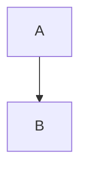
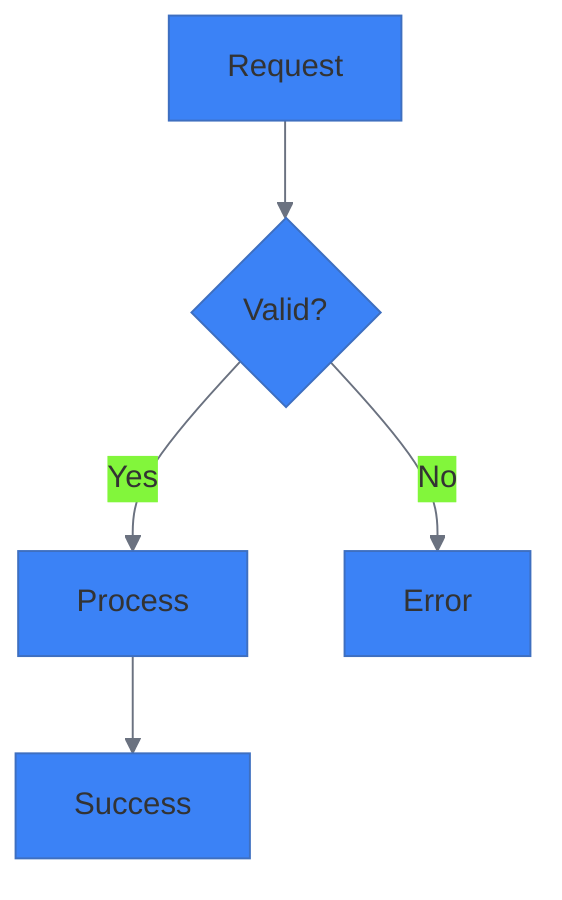
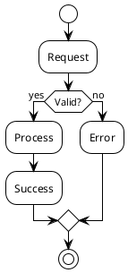
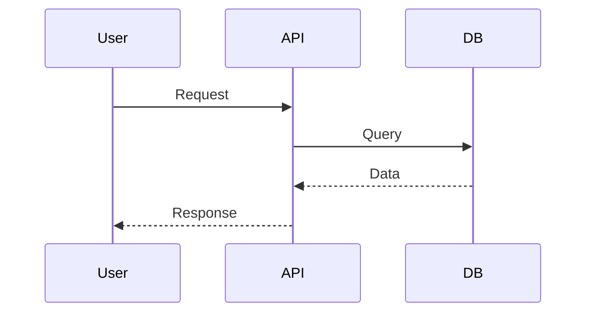
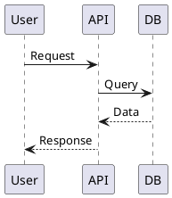

# Multi-Platform Diagram Support

The slidev plugin generates diagrams across three platforms: **Mermaid**, **PlantUML**, and **Excalidraw**.

**Important:** This is NOT mechanical conversion between formats. Each platform receives a **semantically designed diagram** that leverages its unique strengths and visual paradigms.

## Philosophy: Semantic Design, Not Conversion

**Traditional approach:** Create in one format, convert to others
**Our approach:** Analyze slide semantics, design for each platform's strengths

### Why This Matters

Each diagram platform excels at different visual thinking:

- **Mermaid** = Flow and direction (pipelines, sequences, state machines)
- **PlantUML** = Structure and relationships (architecture, UML, components)
- **Excalidraw** = Spatial and informal (sketches, whiteboarding, annotations)

When you create diagrams, you get **three different visual perspectives** on the same concept, each optimized for its platform.

See `docs/semantic-diagram-design.md` for detailed philosophy and examples.

## Overview

When you create a diagram using `/slides:diagram` or `/slides:enhance-visuals`, the plugin:

1. **Analyzes** slide semantics to understand the core concept
2. **Designs** platform-specific diagrams (not mechanical conversions)
3. **Generates** source files leveraging each platform's capabilities
4. **Renders** diagrams to images (SVG/PNG) when tools are available
5. **Organizes** all files in readable directory structures
6. **Embeds** Mermaid inline by default (Slidev renders at presentation time)
7. **Provides** PlantUML and Excalidraw alternatives for specific use cases

## Supported Platforms

### Mermaid (Primary for Slides)

**Visual Paradigm:** Flow and direction

**Best for:**
- Process flows and pipelines
- Sequence diagrams (API interactions, message passing)
- State machines and lifecycles
- Developer-friendly technical flows

**Design Approach:**
- Emphasize directional movement (A→B→C)
- Clean, minimal aesthetic
- Choose appropriate Mermaid diagram type (flowchart, sequence, state, etc.)
- Leverage Mermaid's syntax simplicity

**Used in slides:**
- Embedded inline (Slidev renders at presentation time)
- No external dependencies
- Supports animations and progressive disclosure

**Rendering:** Inline in Slidev, or offline via `@mermaid-js/mermaid-cli`

---

### PlantUML (Architecture & UML)

**Visual Paradigm:** Structure and relationships

**Best for:**
- Component architecture (packages, interfaces, boundaries)
- Deployment diagrams (nodes, artifacts, topology)
- Class relationships (inheritance, composition, associations)
- Formal UML notation

**Design Approach:**
- Emphasize component boundaries and relationships
- Use UML stereotypes and notation
- Show interfaces and contracts
- Leverage PlantUML's layout algorithms for hierarchies

**Used for:**
- Architecture documentation
- System design discussions
- Integration with technical documentation tools

**Rendering:** Server-based (https://www.plantuml.com/plantuml) or local Java

---

### Excalidraw (Sketching & Brainstorming)

**Visual Paradigm:** Spatial and informal

**Best for:**
- Whiteboard-style sketches
- Brainstorming and ideation
- Conceptual relationships (spatial positioning = meaning)
- Informal, approachable explanations

**Design Approach:**
- Think spatially (proximity, containment, separation)
- Add annotations and callouts
- Use hand-drawn style for approachability
- Design for collaborative editing

**Used for:**
- Editable diagrams for workshops
- Less formal presentations
- Collaborative refinement at https://excalidraw.com
- Sketch aesthetic for brainstorming contexts

**Rendering:** Node.js-based conversion to SVG/PNG

## Configuration

### Global Configuration (`default.json`)

Plugin-level defaults at `cc-slidev/default.json`:

```json
{
  "diagrams": {
    "platforms": {
      "mermaid": {
        "enabled": true,
        "generateRendered": true,
        "renderFormat": "svg",
        "theme": "base"
      },
      "plantuml": {
        "enabled": true,
        "generateRendered": true,
        "renderFormat": "svg",
        "server": "https://www.plantuml.com/plantuml"
      },
      "excalidraw": {
        "enabled": true,
        "generateSource": true,
        "generateRendered": true,
        "renderFormat": "svg"
      }
    },
    "storage": {
      "baseDir": "public/images",
      "namingStrategy": "slide-title-mangled",
      "keepSource": true
    },
    "embedding": {
      "defaultFormat": "mermaid-inline",
      "fallbackToImage": true
    }
  }
}
```

### Per-Presentation Configuration

Override defaults for specific presentations by creating `slidev.config.json` in your presentation directory:

```json
{
  "diagrams": {
    "platforms": {
      "excalidraw": {
        "enabled": false
      },
      "plantuml": {
        "renderFormat": "png",
        "server": "https://my-plantuml-server.com"
      }
    }
  }
}
```

**Configuration Priority**: Presentation config > Plugin default.json > Hardcoded defaults

### Configuration Options

#### Platform Settings

Each platform (`mermaid`, `plantuml`, `excalidraw`) supports:

- **`enabled`** (boolean): Whether to generate this format
- **`generateRendered`** (boolean): Whether to render to image format
- **`renderFormat`** (string): Output format (`"svg"` or `"png"`)
- **`generateSource`** (boolean, Excalidraw only): Whether to create .excalidraw JSON

#### Storage Settings

- **`baseDir`**: Base directory for diagram storage (default: `"public/images"`)
- **`namingStrategy`**: How to name directories (default: `"slide-title-mangled"`)
- **`keepSource`**: Whether to keep source files (default: `true`)

#### Embedding Settings

- **`defaultFormat`**: Primary format for slide embedding (default: `"mermaid-inline"`)
- **`fallbackToImage`**: Fall back to image if inline fails (default: `true`)

## Directory Structure

Diagrams are organized by slide title (mangled to create valid directory names):

```
presentation-directory/
└── public/
    └── images/
        └── device-plugins-turn-gpus-into-schedulable-resources/
            ├── diagram.mmd              # Mermaid source
            ├── diagram.svg              # Mermaid rendered
            ├── diagram.puml             # PlantUML source
            ├── diagram-plantuml.svg     # PlantUML rendered
            ├── diagram.excalidraw       # Excalidraw JSON source
            └── diagram-excalidraw.svg   # Excalidraw rendered
```

### Directory Naming

Slide titles are "mangled" to create safe directory names:
- Convert to lowercase
- Replace non-alphanumeric characters with hyphens
- Collapse multiple hyphens
- Trim leading/trailing hyphens
- Limit to 60 characters

**Example**:
- Slide title: "Device Plugins Turn GPUs Into Schedulable Resources!"
- Directory: `device-plugins-turn-gpus-into-schedulable-resources`

## Usage

### Creating Diagrams

Use `/slides:diagram <slide-number>` to create a diagram for a specific slide:

```
/slides:diagram 21
```

The plugin will:
1. Analyze slide content
2. Suggest diagram types (flowchart, sequence, state, etc.)
3. Present multiple diagram options
4. Generate all enabled formats when you select one
5. Embed Mermaid code inline in the slide

### What Gets Generated

For each diagram, you'll get:

**Mermaid**:
- Source: `diagram.mmd`
- Rendered: `diagram.svg` (if mmdc CLI available)
- Embedded inline in slide

**PlantUML** (if enabled):
- Source: `diagram.puml` (translated from Mermaid)
- Rendered: `diagram-plantuml.svg` (via PlantUML server)

**Excalidraw** (if enabled):
- Source: `diagram.excalidraw` (JSON, translated from Mermaid)
- Rendered: `diagram-excalidraw.svg` (via Node.js rendering)

### Switching Diagram Formats

By default, Mermaid code is embedded inline in slides:

```markdown
# Slide Title


```

To use a different format, replace the Mermaid code block with an image reference:

**Using PlantUML**:
```markdown

```

**Using Excalidraw**:
```markdown

```

### Editing Diagrams

**Mermaid**: Edit the code block directly in `slides.md` or source at `diagrams/<title>.mmd`

**PlantUML**:
- Edit `diagrams/<title>.puml`
- Re-render: `scripts/render-plantuml.sh diagrams/<title>.puml public/images/<title>/diagram-plantuml.svg`

**Excalidraw**:
- Open `diagrams/<title>.excalidraw` at https://excalidraw.com
- Edit visually with drag-and-drop
- Export and save back to `diagrams/<title>.excalidraw`
- Re-render: `scripts/render-excalidraw.sh diagrams/<title>.excalidraw public/images/<title>/diagram-excalidraw.svg`

## Dependencies

### Required
- **`jq`**: For JSON configuration parsing
  - Install: `brew install jq` (macOS) or `apt-get install jq` (Linux)

### Optional (Graceful Degradation)

**Mermaid Rendering**:
- `@mermaid-js/mermaid-cli` (mmdc)
- Install: `npm install -g @mermaid-js/mermaid-cli`
- **If unavailable**: Source files still created, Slidev renders inline

**PlantUML Rendering**:
- Internet connection (for server API) OR
- Local Java + `plantuml.jar`
- **If unavailable**: `.puml` source files still created

**Excalidraw Rendering**:
- Node.js (for translation and rendering)
- **If unavailable**: Manual export from excalidraw.com

## Troubleshooting

### "jq is required but not installed"

Install jq:
```bash
# macOS
brew install jq

# Linux
sudo apt-get install jq

# Windows (WSL)
sudo apt-get install jq
```

### Mermaid Rendering Fails

**Symptoms**: `.mmd` file created but no `.svg`

**Solution**: Install mermaid-cli:
```bash
npm install -g @mermaid-js/mermaid-cli
```

**Workaround**: Slidev renders Mermaid inline, so rendering failure doesn't prevent usage.

### PlantUML Rendering Fails

**Symptoms**: `.puml` file created but no `.svg`

**Causes**:
- No internet connection (can't reach PlantUML server)
- Server timeout
- Invalid PlantUML syntax

**Solutions**:
1. Check internet connection
2. Use local PlantUML: Download `plantuml.jar` to `~/.plantuml/`
3. Verify syntax at https://www.plantuml.com/plantuml/uml/

### Excalidraw Rendering Fails

**Symptoms**: `.excalidraw` file created but no `.svg`

**Causes**:
- Node.js not installed
- Translation created empty/invalid JSON

**Solutions**:
1. Install Node.js
2. Check `.excalidraw` file is valid JSON
3. Open at excalidraw.com and export manually

### Diagrams Not Appearing in Slidev

**Check**:
1. Mermaid code block syntax is correct (triple backticks with `mermaid`)
2. Image paths are correct (relative to slides.md)
3. Files exist in `public/images/` directory

### Translation Issues

Some diagram features may not translate perfectly between formats:

**Mermaid → PlantUML**:
- Complex styling may be lost
- Some Mermaid diagram types have no PlantUML equivalent

**Mermaid → Excalidraw**:
- Automated layout may differ from Mermaid
- Hand-drawn aesthetic is approximate
- Complex shapes simplified

**Workaround**: Edit the generated files manually to refine appearance.

## Best Practices

### 1. Use Mermaid as Primary Format
- Embed inline for best Slidev experience
- Keep PlantUML and Excalidraw as alternatives

### 2. Keep Source Files
- Don't delete `.mmd`, `.puml`, or `.excalidraw` files
- Version control all source files
- Renders can be regenerated from source

### 3. Colorblind-Safe Themes
- Default theme uses verified colorblind-safe colors
- Don't override without testing (use ColorBrewer palettes)

### 4. Cognitive Load Limits
- Max 7-9 nodes/elements per diagram
- Split complex diagrams across multiple slides
- Use progressive disclosure for builds

### 5. Per-Presentation Configuration
- Disable unused formats for faster generation
- Override PlantUML server for private networks
- Adjust render formats based on export needs

## Advanced Usage

### Custom PlantUML Server

For private networks or custom styling:

```json
{
  "diagrams": {
    "platforms": {
      "plantuml": {
        "server": "https://my-plantuml-server.internal:8080/plantuml"
      }
    }
  }
}
```

### Disable Specific Platforms

To speed up generation or reduce dependencies:

```json
{
  "diagrams": {
    "platforms": {
      "excalidraw": {
        "enabled": false
      }
    }
  }
}
```

### PNG Instead of SVG

For better compatibility with some export formats:

```json
{
  "diagrams": {
    "platforms": {
      "mermaid": {
        "renderFormat": "png"
      },
      "plantuml": {
        "renderFormat": "png"
      }
    }
  }
}
```

## Examples

### Flowchart Diagram

**Generated Mermaid** (inline in slide):


**Generated PlantUML** (`diagram.puml`):


**Generated Excalidraw** (`diagram.excalidraw`):
- Hand-drawn style rectangles and arrows
- Editable at excalidraw.com
- Same flow structure

### Sequence Diagram

**Mermaid**:


**PlantUML**:


## Summary

Multi-platform diagram support provides:
- **Flexibility**: Use the best tool for each context
- **Portability**: Share diagrams across platforms
- **Editability**: Visual editing with Excalidraw, text editing with Mermaid/PlantUML
- **Compatibility**: Export to any format needed
- **Simplicity**: Automatic generation, no manual conversion

All managed with simple configuration and automatic workflows.
