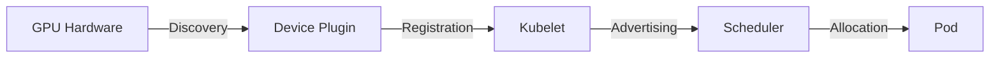
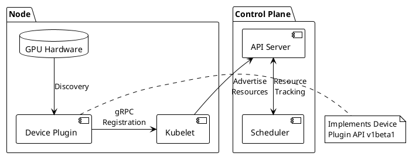
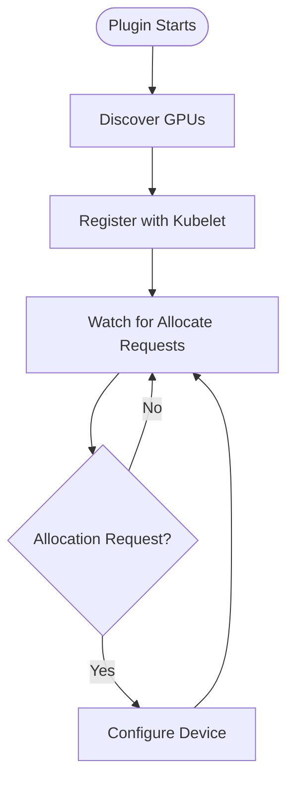
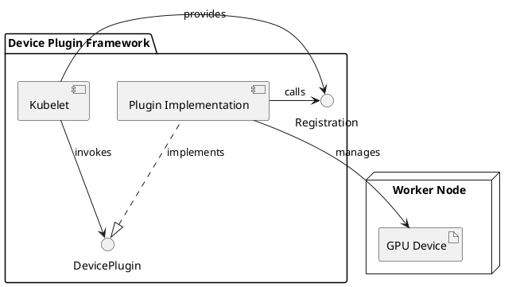

# Diagram Design Philosophy

## Core Principle: Semantic Redesign, Not Mechanical Conversion

**Don't convert diagrams between formats. Redesign them.**

Each diagram platform (Mermaid, PlantUML, Excalidraw) represents a different way of **thinking visually**. When creating multi-platform diagrams, analyze the slide's core concept and design platform-specific diagrams that leverage each tool's unique strengths.

## Platform Comparison

| Platform | Best For | Visual Paradigm | Key Strengths | When to Use |
|----------|----------|-----------------|---------------|-------------|
| **Mermaid** | Flow, process, sequences | Linear, structured | Clean syntax, real-time rendering, developer-friendly | Workflows, pipelines, state machines, API flows |
| **PlantUML** | Architecture, UML, formal models | Hierarchical, relational | Rich UML notation, component boundaries, deployment contexts | System architecture, class relationships, deployment diagrams |
| **Excalidraw** | Sketches, brainstorming, informal | Spatial, freeform | Hand-drawn style, flexible positioning, annotations | Whiteboard sessions, conceptual thinking, informal explanations |

## Design Process

### Step 1: Analyze Slide Semantics

Ask yourself:
- What is the **core concept** of this slide?
- Is it about:
  - **Process/Flow?** (A→B→C progression)
  - **Structure/Architecture?** (Components and relationships)
  - **Concept/Idea?** (Abstract thinking, brainstorming)
  - **State/Lifecycle?** (Transitions and conditions)
  - **Comparison?** (Side-by-side options)

### Step 2: Match to Platform Strengths

| Slide Semantic | Best Platform | Why |
|----------------|---------------|-----|
| Process/workflow | **Mermaid flowchart** | Directional flow, clear entry/exit |
| API interactions | **Mermaid sequence** | Time-based message passing |
| System architecture | **PlantUML component** | Component boundaries, interfaces |
| Deployment topology | **PlantUML deployment** | Physical node placement |
| Class design | **PlantUML class** | Inheritance, relationships, methods |
| Brainstorming | **Excalidraw sketch** | Informal, flexible, annotatable |
| Conceptual relationships | **Excalidraw spatial** | Proximity, grouping, containers |

### Step 3: Design for Platform (Not Conversion)

**Don't think:** "How do I convert this diagram?"

**Think:**
- **Mermaid:** "What is the flow or sequence here?"
- **PlantUML:** "What are the components and their relationships?"
- **Excalidraw:** "How can I sketch this to make it clearer?"

## Platform-Specific Guidelines

### Mermaid: Flow and Direction

**Visual Thinking:** "How does this move/transform/progress?"

**Design Questions:**
1. What is the entry point and exit point?
2. What are the transformation steps?
3. Are there decision points or branches?
4. Is this better shown as a flowchart, sequence, or state diagram?

**Example:**
For a slide about "Device plugins transform GPUs into schedulable Kubernetes resources":



**Why Mermaid?** Emphasizes the **flow of information** from hardware through orchestration to workload.

**Leverage Mermaid Features:**
- Subgraphs for logical grouping
- Different arrow types (solid, dotted, thick)
- Node shapes (rectangle, circle, diamond for decisions)
- Labels on edges
- Multiple diagram types (flowchart, sequence, state, class, ER, gantt)

### PlantUML: Structure and Relationships

**Visual Thinking:** "How do these components relate and interact?"

**Design Questions:**
1. What are the architectural components?
2. What are the boundaries (packages, layers, nodes)?
3. What interfaces or contracts exist?
4. Is this better shown as component, deployment, class, or activity diagram?

**Example:**
For the same slide, emphasizing architecture:



**Why PlantUML?** Shows **component boundaries**, packages, and formal relationships. Emphasizes architectural structure over flow.

**Leverage PlantUML Features:**
- Packages and namespaces
- Stereotypes (<<service>>, <<database>>)
- Interface definitions
- Notes and annotations
- Deployment nodes and artifacts
- Rich UML notation

### Excalidraw: Spatial and Informal

**Visual Thinking:** "How can I sketch this to make it approachable and clear?"

**Design Questions:**
1. What spatial relationships matter (proximity, containment, separation)?
2. What annotations would add insight?
3. How can informal style make this more approachable?
4. What groupings or containers provide context?

**Example:**
For the same slide, emphasizing spatial/conceptual relationships:

**Visual Layout:**
```
┌──────────────────────────────────────────────────┐
│  Worker Node (hand-drawn container)             │
│                                                  │
│  ┌────────────┐                                  │
│  │   GPU 0    │ ←─────┐                          │
│  │   GPU 1    │       │                          │
│  └────────────┘       │                          │
│                       │                          │
│  ┌───────────────────┴──────┐                    │
│  │   Device Plugin          │                    │
│  │  "Discovers & exposes"   │                    │
│  └───────────┬──────────────┘                    │
│              │ gRPC                               │
│              ↓                                    │
│  ┌────────────────────────┐                      │
│  │      Kubelet           │                      │
│  │  "Advertises capacity" │                      │
│  └────────────┬───────────┘                      │
└───────────────┼──────────────────────────────────┘
                │ HTTPS
                ↓
        ┌───────────────┐
        │   Scheduler   │ ← "Now aware of GPUs!"
        │ (Control Plane) │
        └───────────────┘
```

**Why Excalidraw?**
- Informal style makes architecture approachable
- Spatial positioning shows "inside node" vs "control plane"
- Annotations add narrative
- Editable for workshop/collaboration

**Leverage Excalidraw Features:**
- Hand-drawn aesthetic (automatic)
- Flexible positioning (pixel-perfect placement)
- Grouping and containers
- Arrows with label attachment
- Color-coded regions
- Free-form annotations

## Best Practices

### 1. Start with Slide Semantics
Always ask: "What is this slide trying to convey?" before choosing platform.

### 2. One Platform Primary
Choose the platform that best fits the slide's core concept. Embed that one inline in Slidev.

### 3. Others are Optional
Generate other platforms only if they add value or user requests multi-platform export.

### 4. Redesign, Don't Convert
Each platform should get a diagram designed for its strengths, not mechanically converted.

### 5. Leverage Platform Features
- **Mermaid:** Use appropriate diagram type (flowchart vs sequence vs state)
- **PlantUML:** Use stereotypes, packages, proper UML notation
- **Excalidraw:** Use spatial positioning, annotations, grouping

### 6. Keep It Simple
All platforms benefit from cognitive load limits (≤6-7 elements per diagram).

## Multi-Platform Workflow

When creating diagrams for multiple platforms:

**Option 1: Single Platform**
- Analyze slide semantics
- Choose best-fit platform
- Design diagram leveraging platform strengths
- Embed inline (Mermaid) or reference image

**Option 2: All Platforms (Semantic Redesign)**
- Analyze slide semantics once
- Design **three different diagrams** - each optimized for its platform
- User gets three different visual perspectives on the same concept
- Store all sources in `diagrams/`, renders in `public/images/`

## File Organization

**Sources** (`diagrams/`):
- Version-controlled, editable
- `diagram-name.mmd` (Mermaid)
- `diagram-name.puml` (PlantUML)
- `diagram-name.excalidraw` (Excalidraw JSON)

**Renders** (`public/images/diagram-name/`):
- Generated artifacts, can be regenerated
- `diagram.svg` (Mermaid render)
- `diagram-plantuml.svg` (PlantUML render)
- `diagram-excalidraw.svg` (Excalidraw render)

## Examples: Same Concept, Three Platforms

### Slide: "Kubernetes Device Plugin Workflow"

#### Mermaid Design (Flow)

**Emphasis:** Step-by-step process flow.

#### PlantUML Design (Architecture)

**Emphasis:** Component relationships and interfaces.

#### Excalidraw Design (Conceptual)
Hand-drawn sketch showing:
- Worker Node container with GPU hardware
- Device Plugin labeled "Your code"
- Kubelet labeled "K8s agent"
- Scheduler outside node labeled "Control Plane"
- Annotations: "Hardware", "discovers", "registers via gRPC", "reports capacity", "Now aware of GPUs!"

**Emphasis:** Informal, annotated, shows "where code lives."

## Summary

**Old approach:** Create in one format, mechanically convert to others
**New approach:** Analyze slide semantics, design diagrams for each platform's strengths

**Key principle:** Each diagram platform is a different **way of thinking visually**. Use the right thinking for the right concept.

**Result:** Platform-appropriate diagrams that leverage each tool's unique capabilities, not lowest-common-denominator conversions.
