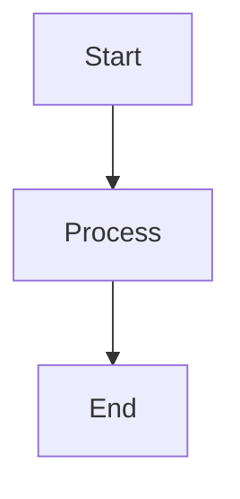
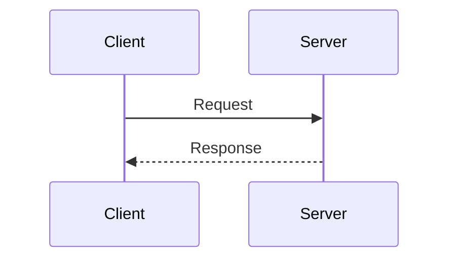

# Test: Diagram Extraction and Regeneration Workflow

This test validates the complete diagram workflow requested in message 8.

## Test Goals

1. ✅ Extract inline diagrams from slides
2. ✅ Generate readable slug directories (not mangled)
3. ✅ Convert to all platforms (Mermaid, PlantUML, Excalidraw)
4. ✅ Verify Excalidraw has proper arrow connections
5. ✅ Ensure smooth workflow execution

## Test Setup

Create a minimal test presentation with inline diagrams:

```markdown
---
theme: default
---

# Test Presentation

---

# Slide 2: Simple Flowchart



---

# Slide 3: Device Plugins Turn GPUs Into Schedulable Resources


---

# Slide 4: Sequence Diagram


```

## Test Execution

### 1. Verify Modular Slide Structure

Read `test-slides.md` and verify it contains slide comments:

```markdown
<!-- Slide 2: First Content Slide -->
src: ./slides/first-content.md
---

<!-- Slide 3: Second Content Slide -->
src: ./slides/second-content.md
---
```

Expected: Comments show correct slide numbers (2, 3, 4) matching Slidev rendering

### 2. Test Slug Generation

```bash
${CLAUDE_PLUGIN_ROOT}/scripts/create-diagram-slug.sh "Device Plugins Turn GPUs Into Schedulable Resources" 3
```

Expected output: `slide-3-device-plugins-gpus` (NOT `device-plugins-turn-gpus-into-schedulable-resources`)

### 3. Test Multi-Platform Generation

```bash
${CLAUDE_PLUGIN_ROOT}/scripts/generate-multi-platform-diagram.sh \
  "3. Device Plugins Turn GPUs Into Schedulable Resources" \
  "$(cat <<'EOF'
flowchart LR
    GPU[GPU Hardware] --> DP[Device Plugin]
    DP --> K8s[Kubelet]
    K8s --> Sched[Scheduler]
EOF
)" \
  "."
```

Expected files created:
- `public/images/slide-3-device-plugins-gpus/diagram.mmd`
- `public/images/slide-3-device-plugins-gpus/diagram.svg` (if mmdc available)
- `public/images/slide-3-device-plugins-gpus/diagram.puml`
- `public/images/slide-3-device-plugins-gpus/diagram-plantuml.svg`
- `public/images/slide-3-device-plugins-gpus/diagram.excalidraw`
- `public/images/slide-3-device-plugins-gpus/diagram-excalidraw.svg`

### 4. Verify Excalidraw Arrow Connections

```bash
cat public/images/slide-3-device-plugins-gpus/diagram.excalidraw | \
  jq '.elements[] | select(.type == "arrow") | {type, startBinding, endBinding}'
```

Expected: Each arrow should have `startBinding` and `endBinding` with `elementId` properties.

### 5. Test Configuration Reading

```bash
${CLAUDE_PLUGIN_ROOT}/scripts/read-diagram-config.sh .
```

Expected: JSON output with merged configuration from default.json

## Validation Checklist

- [ ] Slide numbers match Slidev's actual numbering
- [ ] Directory names are readable slugs
- [ ] Mermaid source (.mmd) is saved
- [ ] Mermaid rendering (.svg) works if mmdc available
- [ ] PlantUML source (.puml) is generated
- [ ] PlantUML rendering (.svg) works
- [ ] Excalidraw source (.excalidraw) is valid JSON
- [ ] Excalidraw arrows have startBinding and endBinding
- [ ] Excalidraw rendering (.svg) works
- [ ] All files are in correctly named directory

## Known Issues to Watch For

1. **Slide number drift**: Verify Python script counts correctly
2. **Missing arrow connections**: Verify Excalidraw JSON has bindings
3. **Mangled directory names**: Verify slugs are short and readable
4. **Configuration merging**: Verify defaults are applied correctly

## Success Criteria

All checklist items pass, and the workflow executes smoothly without manual intervention.
