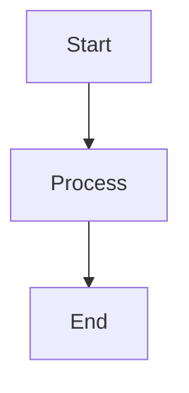
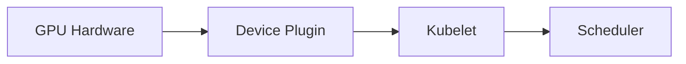
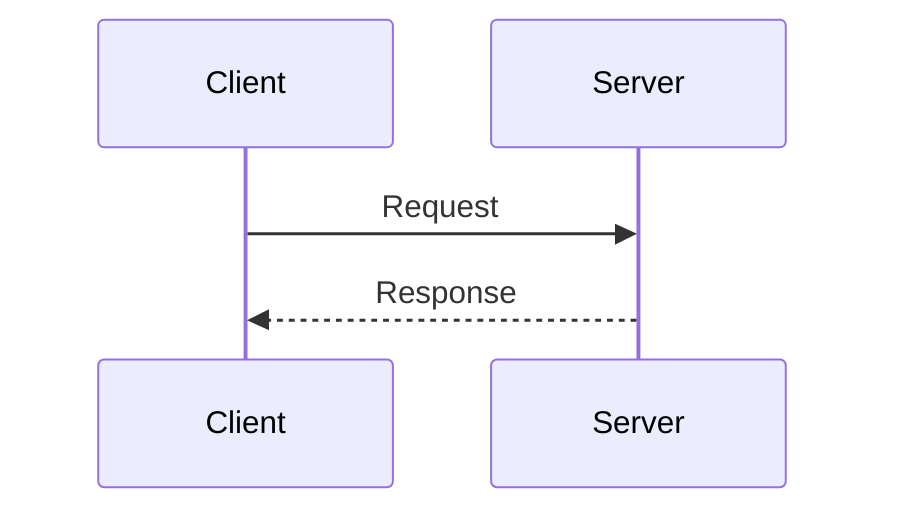

# Test Presentation

Testing diagram extraction and regeneration

---

# Simple Flowchart

Basic three-node flowchart for testing.

---

# Device Plugins Turn GPUs Into Schedulable Resources

This slide has a longer title to test slug generation.

---

# Sequence Diagram

Testing sequence diagram conversion.

